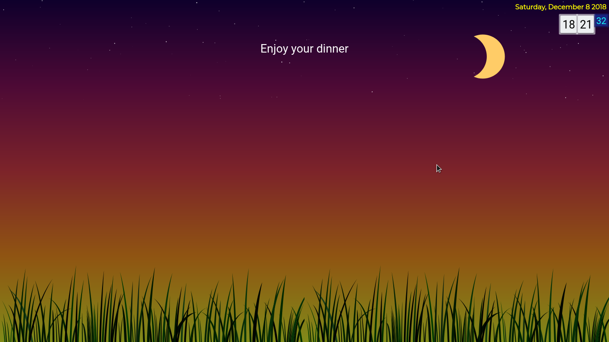

# Simplicity
What do you expect? It's just another customization option for New Tab pages.

Originally intended for Chromium-based browsers, but it looks like I only need to add a line
to make it work properly with Firefox. Still, I test it in Chromium.

## Installation
#### Chromium and derivatives
- If you want to test the extension:
  - `git clone` this repository.
  - Go to the [Extensions](chrome://extensions) page, and enable Developer mode.
  - Then choose `Load unpacked...` and navigate to this repository.
  - Enable the extension.
  - Press Ctrl + T and enjoy.
- If you want to use daily : go to

#### Firefox (tested on version 62.0.3, 64-bit system)
- If you want to test the extension:
  - `git clone` this repository.
  - Go to [`about:debugging`](about:debugging) page.
  - Choose "Enable add-on debugging".
  - Choose "Load temporary Add-on...", then choose the `manifest.json` inside the repository.
  - Open a new tab and enjoy.

## Screenshot(s)

## Licensing
### The extension itself
`Simplicity` (c) by **@minhducsun2002**

This extension is licensed under a Creative Commons Attribution 4.0 International License.

You should have received a copy of the license along with this
work. If not, see <http://creativecommons.org/licenses/by/4.0/>.

### External libraries
Each external library found in [`external/`](external/) comes with its own license, which has
a copy preseved at the time it was downloaded.
- [MaterializeCSS](external/materialize/README.md), version `1.0.0-rc2`, comes with [MIT license](external/materialize/LICENSE)
- `moment.js`, version `2.22.2`, comes with [MIT license](external/materialize/LICENSE)
